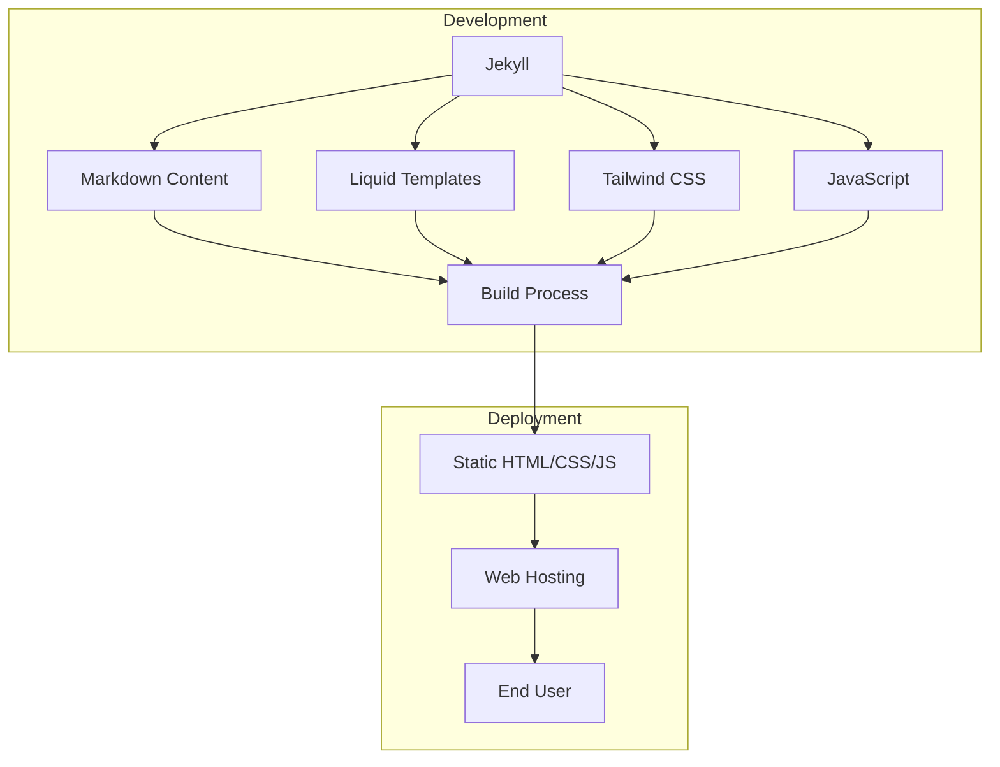
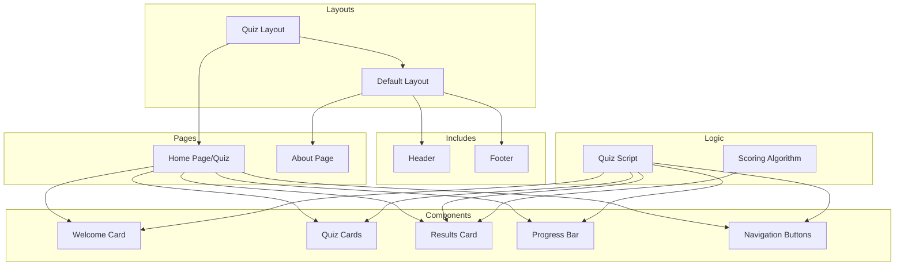

# System Patterns: PollPal.nyc

## System Architecture

PollPal.nyc follows a static site architecture using Jekyll as the static site generator. This architecture was chosen for its simplicity, security, and performance benefits.

### Key Components

1. **Content Layer**
   - Markdown files for page content
   - YAML front matter for page metadata
   - Jekyll collections for structured content (candidates)

2. **Presentation Layer**
   - Liquid templates for layouts and includes
   - Tailwind CSS for styling
   - Responsive design patterns

3. **Interaction Layer**
   - Vanilla JavaScript for quiz functionality
   - DOM manipulation for dynamic content
   - Client-side scoring algorithm

4. **Build System**
   - Jekyll build process
   - Asset compilation and optimization
   - Configuration via _config.yml

## Design Patterns

### Front-End Patterns

1. **Component-Based Structure**
   - Header and footer as reusable includes
   - Quiz card components with consistent styling
   - Progress indicators and navigation elements

2. **Progressive Disclosure**
   - Welcome screen → Quiz questions → Results
   - One question displayed at a time
   - Progress bar to show completion status

3. **Visual Feedback**
   - Interactive elements change appearance on hover/selection
   - Animated progress bar
   - Animated results bars

4. **Mobile-First Responsive Design**
   - Flexible layouts that adapt to screen size
   - Touch-friendly UI elements
   - Readable typography at all sizes

### Data Patterns

1. **Candidate Position Mapping**
   - Positions stored as arrays with numeric values (+1, 0, -1)
   - Each array index corresponds to a specific quiz question
   - Consistent scoring system across all candidates

2. **User Response Collection**
   - Radio button selection for agree/disagree/skip
   - Values mapped to numeric scores for comparison
   - Client-side storage only (no server persistence)

3. **Scoring Algorithm**
   - Multiplication of user stance and candidate stance
   - Summation of products to calculate total alignment
   - Normalization of scores for percentage display

## Component Relationships

## Technical Decisions

### Static Site Generation

**Decision**: Use Jekyll instead of a dynamic framework like React or a CMS.

**Rationale**:
- Simple content that doesn't require frequent updates
- No need for user accounts or data persistence
- Better performance and security with static files
- Lower hosting costs and maintenance requirements

### CSS Framework

**Decision**: Use Tailwind CSS instead of Bootstrap or custom CSS.

**Rationale**:
- Utility-first approach enables rapid UI development
- Highly customizable to match design requirements
- Results in smaller CSS footprint when properly optimized
- Modern approach that works well with component-based design

### JavaScript Approach

**Decision**: Use vanilla JavaScript instead of a framework like React or Vue.

**Rationale**:
- Quiz functionality is relatively simple
- No complex state management required
- Reduces load time and improves performance
- Easier maintenance for developers unfamiliar with specific frameworks

### Deployment Strategy

**Decision**: Deploy as static files to a CDN-enabled hosting service.

**Rationale**:
- Maximizes performance with global edge caching
- Simplifies deployment process
- Reduces security concerns
- Scales automatically with traffic spikes
